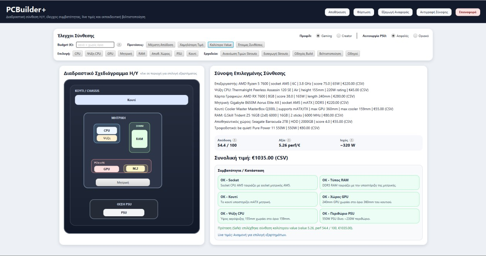

# PCBuilder+

[](https://github.com/Vasilis-Marselos/PCBuilderPlus/actions/workflows/build.yml)

**A JavaFX desktop assistant for choosing PC components, checking compatibility and comparing builds.**

Developed by **Vasileios Marselos** as a BSc (Hons) Computer Science thesis project at Metropolitan College / University of East London (2026). It brings together my interests in software development and PC hardware.



*Application screenshot from the thesis. The interface is primarily in Greek; this repository's documentation is in English.*

## What it does

- Select CPU, GPU, motherboard, RAM, storage, power supply, case and cooler from bundled CSV catalogues.
- Check CPU sockets, memory type, motherboard form factor, GPU clearance, cooler dimensions and PSU headroom.
- Compare cost, indicative performance and value across gaming and creator profiles, with budget-based recommendations.
- Save and reload configurations (`.pcbuild`) and export a plain-text build report.
- Display assembly guidance, optimisation tips and a tutorial library.
- Experiment with Skroutz product discovery and price refresh, with confidence labels and fallback catalogue prices.

## Quick start

Requires **JDK 21 or later**, **Maven 3.9+**, and a graphical desktop. Dependencies are downloaded on the first build.

```sh
git clone https://github.com/Vasilis-Marselos/PCBuilderPlus.git
cd PCBuilderPlus
mvn clean verify
mvn javafx:run
```

Ensure `java -version` and `mvn -version` both use JDK 21 or later. JavaFX is managed by Maven; no separate JavaFX SDK is needed. Run from the project directory.

### Try the local catalogue first

1. Select a gaming or creator profile and optionally enter a budget.
2. Choose components using the CPU, GPU, motherboard and other selection buttons, or try a suggested configuration.
3. Inspect the compatibility cards, total price and estimated power.
4. Save the configuration, reload it, and export a report.

Component selection, compatibility calculations and bundled catalogue data work without live price requests after dependencies have been downloaded. External tutorials, live prices and marketplace browsing require internet access. The embedded Chromium browser downloads its native runtime into `jcef-bundle/` on first use; this is a separate, potentially large download.

## Technology and structure

Java 21 · JavaFX 23 / FXML · Maven · jsoup · JCEF / jcefmaven · CSV · JUnit 5

| Location | Purpose |
| --- | --- |
| `src/main/java/com/pcbuilder/App.java` | JavaFX entry point |
| `MainController.java` and other controllers | Selection, recommendations, UI workflows and persistence |
| `services/` | Compatibility checks, power estimates and build scoring |
| `data/CsvCatalogRepository.java` | Bundled component catalogue loading |
| `pricing/` | Price lookup, matching confidence and price cache |
| `src/main/resources/com/pcbuilder/` | FXML views |
| `src/main/resources/data/` | Eight component catalogues |
| `src/test/java/com/pcbuilder/` | Offline regression tests |

This is an academic desktop application. Some orchestration and recommendation logic remains in the main controller; extracting it into smaller services is a possible next improvement.

## Testing

```sh
mvn clean verify
```

The automated tests added for the public release cover compatible and incompatible component combinations, physical-clearance boundaries, PSU capacity boundaries, empty builds, power estimation and loading all eight catalogues. They do not contact external marketplaces.

**Verified:** clean Maven builds and all ten offline regression tests passed on both Windows and Linux with Java 21. The additional JavaFX smoke test passed on Linux, loading four local views under a virtual display. [View the verified build](https://github.com/Vasilis-Marselos/PCBuilderPlus/actions/runs/36052794385).

The original thesis separately documents ten manual test scenarios. Those thesis scenarios and this repository's automated tests are distinct. See [validation and publication notes](docs/VALIDATION.md) for the checks performed on this publication copy.

GitHub Actions runs the regression suite on Windows and Linux with Java 21. On Linux it additionally loads four local JavaFX views under a virtual display. To run that desktop smoke test locally, use `mvn -Dpcbuilder.uiTests=true test` on a graphical desktop.

## Limitations

- Performance scores are comparative heuristics, not measured benchmarks or guaranteed FPS. Power estimates are approximate rather than electrical measurements.
- Compatibility uses available catalogue fields and some inferred values. It does not comprehensively validate BIOS support, power connectors, every clearance interaction or all manufacturer specifications.
- Bundled prices and specifications are a project snapshot, not current purchasing advice.
- Live price retrieval is experimental and depends on third-party website structure and access restrictions. It is not an official Skroutz API integration; results may be unavailable or require manual review.
- Embedded Chromium behaviour depends on OS/native-runtime support. Cross-platform interactive behaviour has not been fully verified.

## Publication and rights

This repository contains a clean source copy, documentation and an application screenshot. The full thesis PDF, IDE settings, browser runtime/cache, local build outputs and user-saved configurations are excluded.

Copyright © 2026 Vasileios Marselos. No additional open-source licence is granted at this time. Dependencies and third-party names/content retain their respective licences and rights; see [third-party notes](docs/THIRD_PARTY.md). The application is not affiliated with the hardware manufacturers or marketplaces it references.

[LinkedIn](https://www.linkedin.com/in/vasileiosmarselos) · [GitHub](https://github.com/Vasilis-Marselos)
